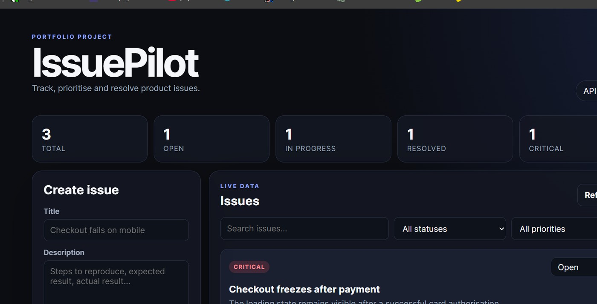

# IssuePilot

[](https://github.com/tefik-aliu/issuepilot/actions/workflows/tests.yml)


**IssuePilot** is a compact full-stack issue tracker built to demonstrate API design, database persistence, frontend integration, validation and automated testing.



## Highlights

- Create, search, filter, update and delete product issues
- Track priority and workflow status
- Live dashboard statistics
- REST API with automatic OpenAPI documentation
- SQLite persistence with parameterised SQL queries
- Responsive frontend built with HTML, CSS and vanilla JavaScript
- Automated API tests with Pytest
- Optional end-to-end browser test with Playwright
- Docker configuration and GitHub Actions continuous integration

## Technology

| Area | Technology |
|---|---|
| Backend | Python, FastAPI |
| Database | SQLite |
| Frontend | HTML, CSS, JavaScript |
| API tests | Pytest, FastAPI TestClient |
| Browser testing | Playwright |
| Delivery | Docker, GitHub Actions |

## Architecture

```text
Browser interface
       |
       | JSON over HTTP
       v
FastAPI REST API
       |
       | parameterised SQL
       v
SQLite database
```

## API routes

| Method | Route | Purpose |
|---|---|---|
| `GET` | `/api/health` | Application health check |
| `GET` | `/api/issues` | List, search and filter issues |
| `POST` | `/api/issues` | Create an issue |
| `PATCH` | `/api/issues/{id}` | Update an issue |
| `DELETE` | `/api/issues/{id}` | Delete an issue |
| `GET` | `/api/stats` | Retrieve dashboard statistics |

Interactive API documentation is available at `/docs` while the application is running.

## Run locally

### Windows quick start

```powershell
Set-ExecutionPolicy -Scope Process Bypass
.\setup_windows.ps1
.\.venv\Scripts\python.exe -m app.seed
.\run_windows.ps1
```

Open:

```text
http://127.0.0.1:8000
```

### Manual setup

```bash
python -m venv .venv
```

Activate the environment:

```bash
# Windows PowerShell
.venv\Scripts\Activate.ps1

# macOS / Linux
source .venv/bin/activate
```

Install dependencies and start the server:

```bash
pip install -r requirements.txt
uvicorn app.main:app --reload
```

## Run the tests

API test suite:

```bash
pytest -m "not e2e"
```

Optional Playwright test:

```bash
playwright install chromium
```

Start the application in one terminal, then run:

```powershell
# Windows PowerShell
$env:RUN_E2E="1"
pytest tests/test_e2e.py -m e2e
```

## Design decisions

- **FastAPI** provides typed request validation and automatic API documentation.
- **SQLite** keeps local setup simple while still demonstrating persistence and SQL.
- **Parameterised queries** prevent user input from being inserted directly into SQL.
- **Separate API and browser tests** cover different failure modes.
- **Vanilla JavaScript** keeps the frontend transparent and easy to inspect.

## Possible next steps

- Authentication and role-based access
- Comments and file attachments
- PostgreSQL production configuration
- Public cloud deployment
- Expanded CI browser testing

## Author

Built by [Tefik Aliu](https://github.com/tefik-aliu) as a software development and QA portfolio project.

## License

MIT
